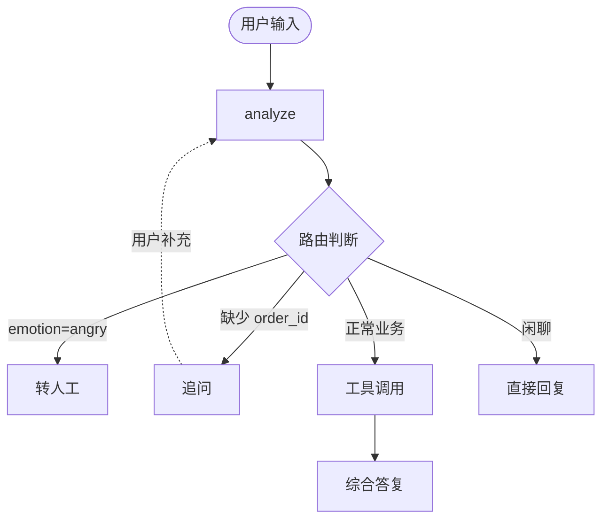

# 智能电商售后中控系统

基于 **LangChain + LangGraph + DeepSeek Chat** 的电商售后 AgentRouter，覆盖 3 个核心场景：

- **场景 A**：多步逻辑（识别「蓝牙耳机」→「电子产品」→ 同时调用订单+政策工具 → 综合答复）
- **场景 B**：缺失信息追问（先反问订单号 → 多轮上下文记忆 → 补全后正确执行）
- **场景 C**：情绪风控（识别愤怒情绪 → 直接转人工，跳过常规流程）

## 项目结构

```
ecom-after-sales-agent/
├── src/
│   ├── __init__.py
│   ├── __main__.py          # Demo 入口 (python -m src)
│   ├── cli/                  # CLI 交互模式
│   │   ├── __init__.py
│   │   ├── __main__.py
│   │   └── main.py
│   ├── llm.py               # DeepSeek Chat 接入
│   ├── tools.py             # 3 个 Mock 工具
│   ├── state.py             # AgentState 定义
│   ├── router.py            # 意图/情绪/实体分析
│   └── graph.py             # LangGraph 工作流
├── tests/
│   └── test_scenarios.py    # 3 个场景的端到端测试
├── docs/
│   ├── architecture.md      # 架构设计文档
│   └── workflow.md          # Agent 工作流 Mermaid 图
├── output/
│   ├── run_log.png          # 运行截图
│   ├── run_log.txt          # 运行日志
│   └── run_log.html         # 终端风格 HTML
├── requirements.txt
├── .env.example
├── LICENSE
└── README.md
```

## 快速开始

### 1. 安装依赖

```bash
pip install -r requirements.txt
```

### 2. 配置 API Key

复制 `.env.example` 为 `.env`，填入你的 DeepSeek API Key：

```bash
cp .env.example .env
# 编辑 .env，设置 DEEPSEEK_API_KEY
```

### 3. 运行 Demo

**运行三个测试场景：**

```bash
python -m src --scenario all
python -m src --scenario A       # 仅场景 A
python -m src --scenario B       # 仅场景 B
python -m src --scenario C       # 仅场景 C
```

**CLI 交互模式：**

```bash
python -m src.cli                # 启动 CLI 对话
python -m src.cli -v             # 启动 CLI 并显示状态摘要
```

### 4. 跑测试

```bash
python -m pytest tests/test_scenarios.py -v
```

## 架构流程图

详见 [docs/workflow.md](docs/workflow.md)，包含：
- 整体 Agent 工作流 Mermaid 图（6 个节点的流转关系）
- 节点职责与触发条件对照表
- 场景 A / B / C 各自的流转路径子图
- State 字段在各节点的读写矩阵



## 核心设计

- **State**：`AgentState` TypedDict，用 `add_messages` reducer 自动累积对话历史
- **Router**：`analyze_node` 一次 LLM 调用同时完成情绪检测 + 意图分类 + 实体抽取，配正则/关键词兜底
- **Graph**：4 条分支 — `escalate` / `ask_info` / `tools→generate` / `direct`
- **Memory**：`MemorySaver` + `thread_id` 实现多轮上下文记忆
- **状态隔离**：每轮分析前重置 per-turn 状态，避免情绪/路由跨轮污染

## Mock 工具

| 工具 | 用途 |
| --- | --- |
| `get_order_status(order_id)` | 返回订单状态、品类、发货时间 |
| `check_refund_policy(category)` | 返回对应品类的退货政策 |
| `escalate_to_human(reason)` | 转人工客服，返回坐席号与排队位 |

Mock 数据位于 [src/tools.py](src/tools.py)，可按需扩展。

## 运行截图

三个场景的完整运行结果见 [output/run_log.png](output/run_log.png)。

## License

[MIT](LICENSE)
