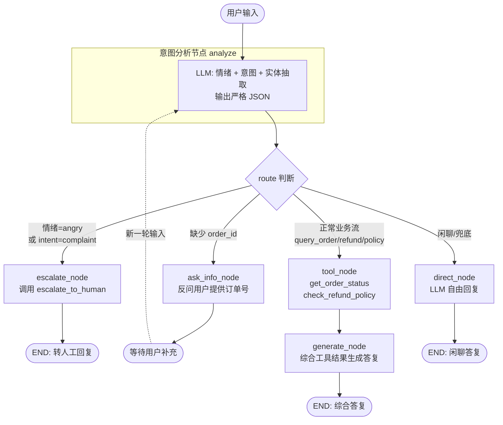

# 智能电商售后中控系统 — 架构设计

## 1. 系统概览

本系统基于 **LangGraph + DeepSeek Chat** 构建一个电商售后中控（AgentRouter），
接收用户自然语言输入，自动完成：

- **意图分析**：识别用户是要查订单 / 退货 / 问政策 / 投诉 / 闲聊
- **情绪检测**：高愤怒情绪直接转人工，跳过常规流程
- **实体抽取**：从口语化输入中抽取出 `order_id`、`category`、`product`
- **工具编排**：根据意图调用对应的 Mock 工具
- **上下文记忆**：支持多轮追问补全信息
- **综合回复**：基于多工具结果生成最终答复

## 2. Agent 工作流（Mermaid）



## 3. 节点职责

| 节点 | 职责 | 输出 |
| --- | --- | --- |
| `analyze` | LLM 调用 + 后处理，抽取 emotion/intent/order_id/category/product | `route` 标记 |
| `escalate` | 调用 `escalate_to_human` 工具，写入转人工回复 | `tool_results.escalate_to_human` |
| `ask_info` | 生成反问文本，等待用户补充 | `final_response` |
| `tools` | 根据 `order_id`/`category` 调用订单/政策工具 | `tool_results` |
| `generate` | LLM 基于工具结果生成综合答复 | `final_response` |
| `direct` | 兜底：交给 LLM 直接回复 | `final_response` |

## 4. 状态字段（AgentState）

```python
class AgentState(TypedDict, total=False):
    messages: list                # LangGraph 自动累积（含 reducer add_messages）
    intent: str                   # 意图分类
    emotion: "angry"|"calm"|"neutral"
    order_id: str | None          # 抽取的订单号
    category: str | None          # 抽取的品类
    product: str | None           # 抽取的具体商品
    reason: str | None            # 转人工原因 / 用户诉求
    route: "escalate"|"ask_info"|"tools"|"direct"
    needs_info: bool              # 是否需要追问
    info_question: str            # 反问内容
    tool_results: dict            # 累积的工具返回
    final_response: str           # 最终回复文本
```

## 5. 三个核心场景对照

| 场景 | 输入 | 路由 | 工具调用 | 期望输出 |
| --- | --- | --- | --- | --- |
| **A 多步逻辑** | 蓝牙耳机 ORD-2024 退货 | `tools` | `get_order_status` + `check_refund_policy` | 综合答复含订单状态、退货政策 |
| **B 追问补全** | 查快递→补充 ORD-9999 | `ask_info` → `tools` | 第 2 轮 `get_order_status` | 第 1 轮反问，第 2 轮返回快递状态 |
| **C 情绪风控** | 愤怒投诉 | `escalate` | `escalate_to_human` | 转人工回复（坐席号 / 排队位） |

## 6. 关键设计决策

1. **统一 LLM 调用做三件事**：情绪 + 意图 + 实体抽取在同一 prompt 内，避免多轮 LLM 开销。
2. **关键词兜底**：订单号 / 品类 / 愤怒情绪均配正则+关键词兜底，避免 LLM 漏抽。
3. **MemorySaver**：用 LangGraph 内置的内存 checkpointer 实现多轮上下文，配合 `thread_id`。
4. **工具直调而非 AgentExecutor**：本场景只有 3 个工具且调用逻辑可控，直接在节点中调用更清晰。
5. **mock 数据驱动**：订单库 / 政策表 / 转人工结果均内置 mock，便于演示与回归测试。
