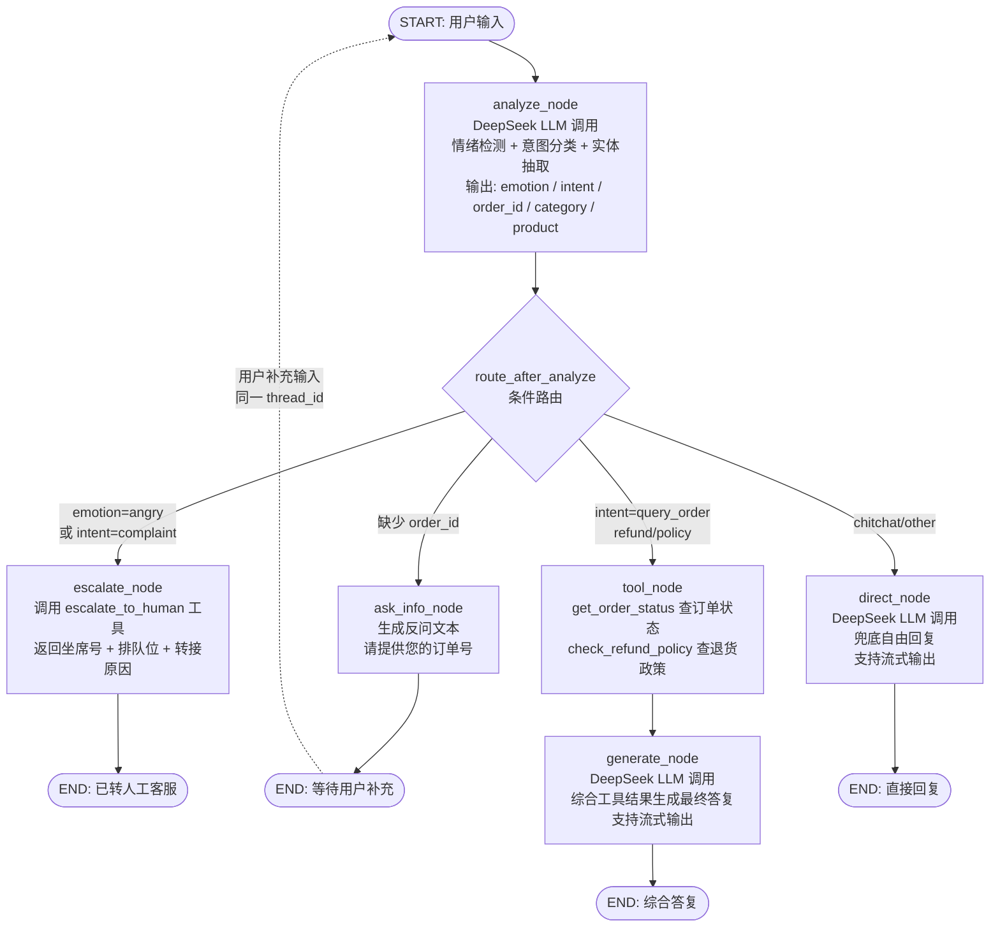
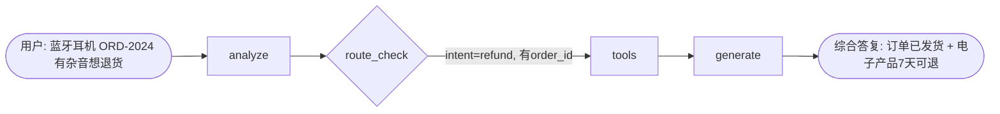
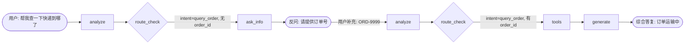
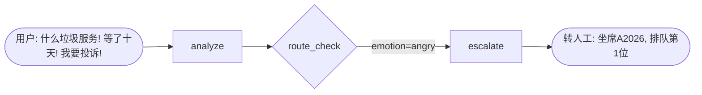

# Agent 工作流

## 1. 整体流程



## 2. 节点流转关系

| 节点 | 触发条件 | 调用的工具/LLM | 输出到 State | 下一节点 |
| --- | --- | --- | --- | --- |
| `analyze` | 每轮用户输入必经 | DeepSeek Chat (JSON 输出) | emotion, intent, order_id, category, product, route | `route_check` |
| `route_check` | analyze 之后 | 纯逻辑判断 (无 LLM) | -- | 四分支之一 |
| `escalate` | emotion=angry 或 intent=complaint | escalate_to_human (Mock) | tool_results, final_response | END |
| `ask_info` | intent=query_order/refund 且缺少 order_id | 无 (模板文本) | final_response, info_question | END (等待下一轮) |
| `tools` | intent=query_order/refund/policy 且有 order_id | get_order_status + check_refund_policy (Mock) | tool_results | `generate` |
| `generate` | tools 执行完毕 | DeepSeek Chat (流式) | final_response | END |
| `direct` | 闲聊/兜底场景 | DeepSeek Chat (流式) | final_response | END |

## 3. 三个场景的流转路径

### 场景 A: 多步逻辑 (蓝牙耳机退货)



**关键数据流:**
- analyze 输出: `intent=refund`, `emotion=calm`, `order_id=ORD-2024`, `category=电子产品`
- tools 调用: `get_order_status(ORD-2024)` -> 已发货 + `check_refund_policy(电子产品)` -> 7天可退
- generate: 综合两个工具结果，生成包含订单状态 + 退货建议的答复

### 场景 B: 缺失信息追问 (查快递)



**关键数据流:**
- 第 1 轮: analyze 识别 `intent=query_order` 但 `order_id=null` -> ask_info 反问
- 第 2 轮: MemorySaver 保留上下文，analyze 从补充输入提取 `order_id=ORD-9999` -> tools -> generate

### 场景 C: 情绪风控 (愤怒投诉)



**关键数据流:**
- analyze 输出: `emotion=angry`, `intent=complaint`
- 路由判断: 情绪风控优先，跳过常规工具调用流程
- escalate 调用 `escalate_to_human("用户情绪激动")` -> 返回坐席号和排队位

## 4. State 字段在各节点的读写

```
                 analyze    escalate   ask_info    tools    generate   direct
messages         R          -          -           -        -          R
intent           W          R          R           R        R          -
emotion          W          R          -           -        -          -
order_id         W          -          R           R        -          -
category         W          -          -           R        -          -
product          W          -          -           -        R          -
reason           W          R          -           -        R          -
route            W          -          -           -        -          -
needs_info       W          -          W           -        -          -
info_question    -          -          W           -        -          -
tool_results     -          W          -           W        R          -
final_response   -          W          W           -        W          W
```

- `R` = 读取, `W` = 写入, `-` = 不涉及
